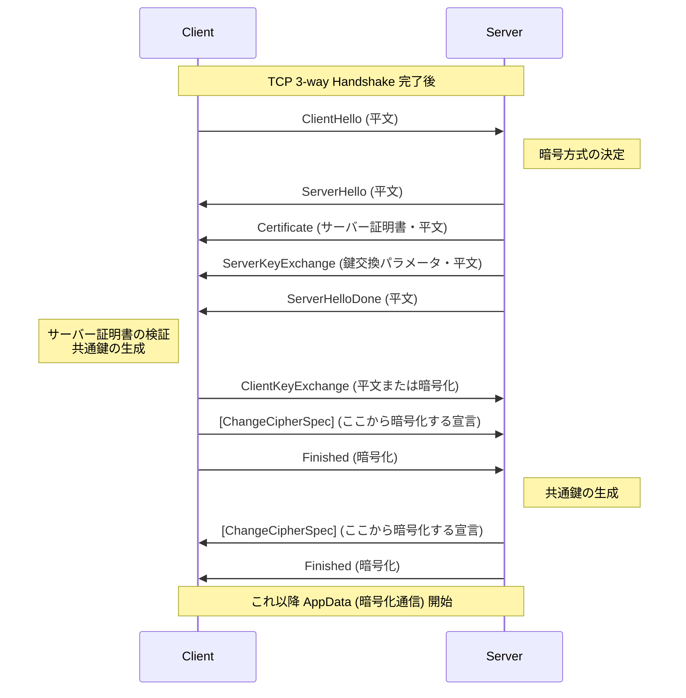
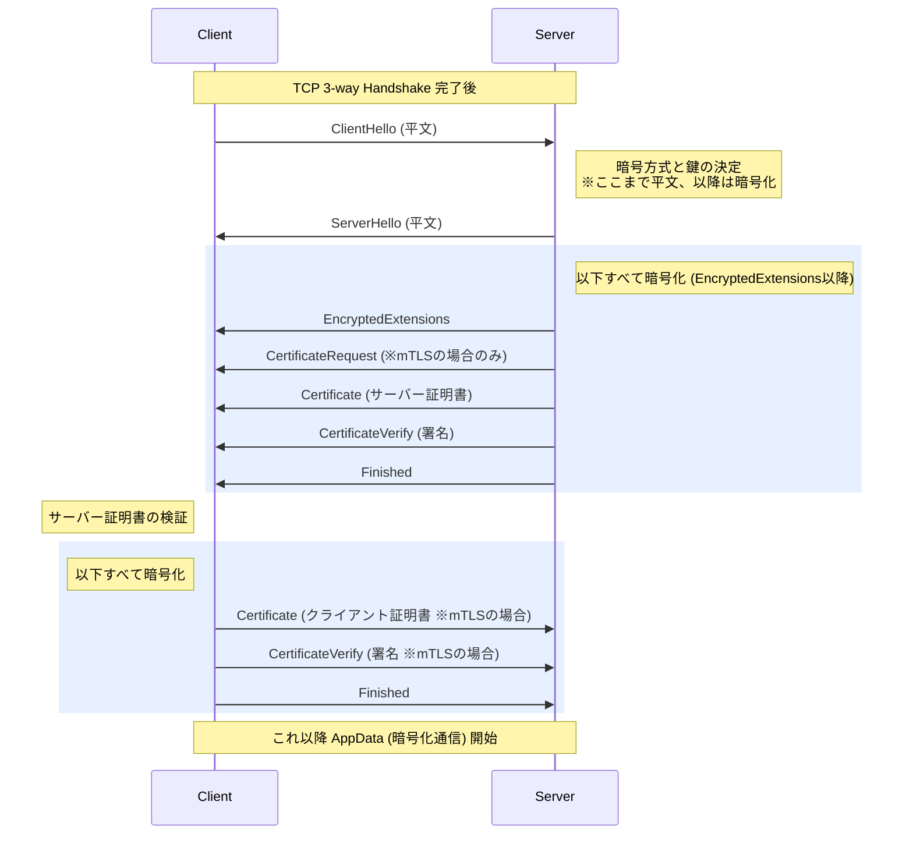

# TLS 1.2 と TLS 1.3 のハンドシェイクフロー比較

このドキュメントでは、TLS 1.2 から TLS 1.3 への進化において、ハンドシェイクのフローがどのように変わったか（パケットキャプチャで観察された内容の裏付け）を解説します。

## 1. TLS 1.2 のハンドシェイクフロー (2-RTT)

TLS 1.2 では、ハンドシェイクが完了してアプリケーションデータの暗号化通信が始まるまでに **「2往復 (2-RTT)」** のやり取りが必要でした。また、サーバーの証明書などは **平文** で送信されていました。

### TLS 1.2 の特徴
* **2往復 (2-RTT)**: クライアントがデータを送り始められるまでに時間がかかる。
* **証明書が丸見え**: `Certificate` メッセージが平文で送られるため、どのドメイン（証明書）に接続しているかネットワーク上で盗聴可能だった。
* **ChangeCipherSpec の存在**: 「ここから先は暗号化するぞ」という明示的なメッセージを双方が送り合っていた。

---

## 2. TLS 1.3 のハンドシェイクフロー (1-RTT)

TLS 1.3 では、セキュリティとパフォーマンスを向上させるためにハンドシェイクが劇的に簡略化されました。データ送信開始まで **「1往復半 (1-RTT)」** に短縮されています。

※ Go 言語の `tls.Config` で `MinVersion: tls.VersionTLS12` と指定しても、双方が TLS 1.3 に対応していれば自動的にこのフローが選ばれます。

### TLS 1.3 の特徴（1.2 からの進化）

1. **スピードアップ (1-RTT)**
   クライアントが `ClientHello` の時点で鍵交換の予測データ（キーシェア）を一緒に送ることで、サーバーは `ServerHello` と共に即座にハンドシェイクを完了させることができます。
   
2. **ハンドシェイクの秘匿化 (EncryptedExtensions)**
   サーバーは `ServerHello` を送った**直後に暗黙的に暗号化モードに切り替わります**。そのため、続く `EncryptedExtensions` や `Certificate`（サーバー証明書）はすべて暗号化され、ネットワーク上の盗聴者からはどのドメインに接続しているか見えなくなりました。
   
3. **ChangeCipherSpec の廃止と互換性モード**
   「ここから暗号化する」という明示的な宣言（ChangeCipherSpec）は仕様から**廃止されました**。
   ただし、世の中の古いファイアウォールなどのネットワーク機器が「ChangeCipherSpec が来ないと不正な通信だと勘違いして遮断する」問題を防ぐため、**「Middlebox Compatibility Mode（互換性モード）」** として意味のない 6 バイトのダミー ChangeCipherSpec を送ることが許容されており、現代の多くの実装（Go など）でもダミーが送信されています。

---

## 3. tcpdump での見分け方まとめ

今回のチュートリアルで採取したダンプにおいて、以下が観察されたらそれは **TLS 1.3** である証拠です。

* **サーバーからのパケットが巨大で1つにまとまっている**
  * `ServerHello` と同時に `Certificate` などが暗号化されて一気に送られてきているため。
* **クライアントの 2 回目の送信が極端に小さい（または mTLS 用のサイズ）**
  * TLS 1.2 のような `ClientKeyExchange` や明示的な `ChangeCipherSpec` を待たず、単に `Finished`（数十バイト）だけを送っているため。（mTLS の場合は自身のクライアント証明書が含まれるので約 1500 バイトほどになります）。
