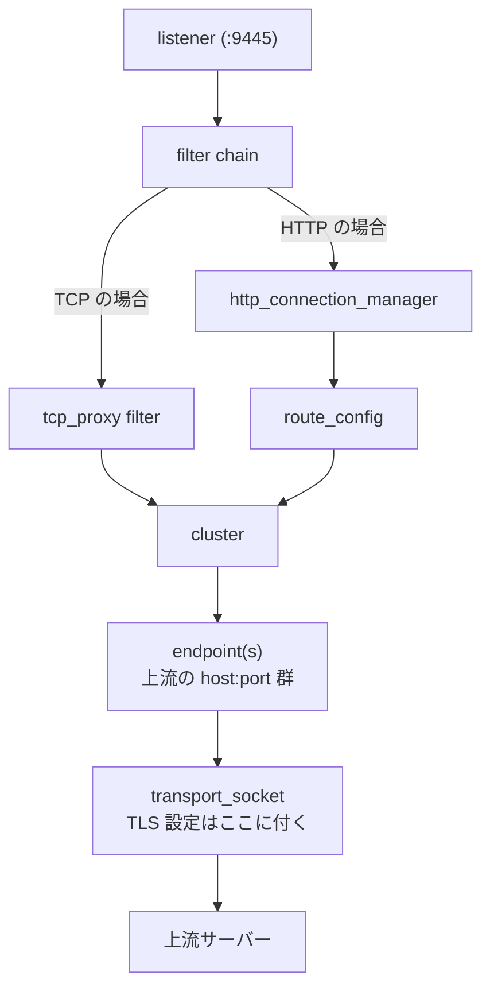

# Envoy 概論 — sidecar 化のメリット・デメリットと他製品比較

このドキュメントでは、[Step 04](../tutorial/step04-envoy-mtls/README.md) で触った **Envoy** について、その立ち位置・基本概念・配置パターン・他製品との比較をまとめます。

Step 04 の README は「動かすための最小設定」だけに絞ってあるので、こちらは「なぜ Envoy なのか」「sidecar にすると何が嬉しくて何が痛いのか」「世の中にどういう選択肢があるのか」を扱います。

## 1. Envoy とは

**[Envoy](https://www.envoyproxy.io/docs/envoy/latest/)** は、Lyft が 2016 年に OSS 公開し、現在は **CNCF の Graduated プロジェクト** になっている **L4/L7 プロキシ** です。

ひとことで言うなら、「**ネットワーク I/O の責任をアプリから剥がして、独立したプロセスに集約するための高機能プロキシ**」です。

| 特徴 | 内容 |
|---|---|
| 言語 | C++ (パフォーマンス重視、ゼロアロケーションを意識した設計) |
| プロトコル | HTTP/1.1, HTTP/2, HTTP/3 (QUIC), gRPC, TCP, TLS, WebSocket, Redis, MongoDB, Kafka, Postgres など |
| 設定 | YAML / JSON の **静的設定** または **xDS API** による動的設定 |
| 観測 | Prometheus 形式のメトリクス, OpenTelemetry トレース, アクセスログ |
| 主な利用先 | Istio / Consul Connect / AWS App Mesh / Gloo / Emissary / Contour などの **データプレーン** |

「Istio が Envoy を使っている」と紹介されることが多いですが、**Envoy は Istio に依存していません**。素の Envoy 単体でリバースプロキシ、API ゲートウェイ、egress プロキシとして使えます。

## 2. なぜ生まれたか — 「ライブラリでやればいいじゃん」では足りなかった話

Envoy 以前、レイテンシ制御 / リトライ / サーキットブレーカ / mTLS / メトリクス収集といった「ネットワーク横串」の機能は、**各言語のライブラリ** (Hystrix, Finagle, gRPC interceptors など) で実装されていました。

これがマイクロサービス化の進行とともに痛くなった:

1. **多言語問題**: Go, Python, Java, Ruby, Node, Rust... 全部に同じ品質の HTTP/2 + mTLS + retry + circuit breaker を実装するのは現実的でない。
2. **アップグレード問題**: 新しい暗号スイートを使いたいたびに、全社の全アプリを再リリースする必要があった。
3. **観測性の品質ばらつき**: 各ライブラリが好き勝手なメトリクス命名・タグをしていた。
4. **TLS 終端の重複実装**: アプリごとに `crypto/tls` を組み立てていた (まさに Step 03 の状態)。

Envoy の発想は **「外出し」** です。アプリは平文 HTTP / TCP を喋って、Envoy が **その横で** TLS / リトライ / メトリクス / トレースをやる。アプリは言語非依存に薄くなる。

## 3. アーキテクチャの基本概念

Step 04 で扱ったものを再整理して、L7 (HTTP) の概念も含めて並べます。



### コアな単語

| 用語 | 役割 | Step 04 の YAML 上の位置 |
|---|---|---|
| **listener** | 接続を受ける入口。`address` + `port` + `filter_chains` を持つ | `listeners[].address` |
| **filter chain** | listener が受けた L4 接続をどう処理するかのパイプライン | `listeners[].filter_chains` |
| **network filter** | L4 で動くフィルタ。`tcp_proxy` (透過) や `http_connection_manager` (HTTP に変換) など | `filter_chains[].filters` |
| **HTTP filter** | L7 で動くフィルタ。`router`, `jwt_authn`, `rbac`, `ext_authz`, `lua`, `wasm` など | (今回は未使用) |
| **route** | HTTP のパス/ホストマッチで cluster を選ぶ層 | (今回は未使用) |
| **cluster** | 「同じ役割の上流ホスト群」の論理単位。LB ポリシー/ヘルスチェック/サーキットブレーカ/TLS が付く | `clusters[]` |
| **endpoint** | cluster の中の実体 (host:port)。`STATIC` / `STRICT_DNS` / `LOGICAL_DNS` / `EDS` で決まり方が変わる | `clusters[].load_assignment` |
| **transport_socket** | 上流 (`UpstreamTlsContext`) や下流 (`DownstreamTlsContext`) との暗号化方式 | `clusters[].transport_socket` |
| **admin** | 統計・設定ダンプ・ログレベル変更を提供する管理ポート | `admin.address` |

### "Listener filter" と "filter chain" の違い (Envoy の罠その 1)

- **listener filter**: 接続が **filter chain にディスパッチされる前** に走る (例: `tls_inspector` が SNI を読んで filter chain を選ぶ)。
- **filter chain**: 実際の処理本体。

最初は混同しやすいですが、「**listener filter は前さばき、filter chain は本処理**」と覚えればよいです。

## 4. xDS — 動的設定のしくみ

Step 04 では `static_resources` だけを使いました。本番運用では **xDS API** で外部の **control plane** (Istiod, Consul, 自作) から設定を流し込みます。

| API | 配信されるもの | 何が嬉しいか |
|---|---|---|
| **LDS** (Listener Discovery Service) | listener の集合 | 新しいポートを開く/閉じるをプロセス再起動なしにできる |
| **CDS** (Cluster Discovery Service) | cluster の集合 | 上流サービスを足す/抜くをそのまま反映 |
| **EDS** (Endpoint Discovery Service) | endpoint の集合 | Pod のスケールアウト/イン、ヘルスチェック結果を即時反映 |
| **RDS** (Route Discovery Service) | HTTP ルートテーブル | カナリアリリース、A/B テスト、トラフィックスプリットがホットで切れる |
| **SDS** (Secret Discovery Service) | TLS 証明書/秘密鍵 | **証明書ローテーションをプロセス再起動なしにできる** |

xDS は本質的には **gRPC streaming で設定 protobuf を流すだけ** の仕組みなので、自作の control plane も書こうと思えば書けます。Istio の Istiod は Kubernetes の `Service` / `Endpoint` / `Pod` を見て、それを Envoy 設定に変換して xDS で配るだけのコンポーネントです。

## 5. 配置パターン

Envoy はどこに置くかで全然違うものになります。

### (a) Edge proxy / API gateway

```
[インターネット] ──HTTPS── [Envoy (edge)] ──HTTP── [サービス群]
```

**「外から内」の入口** に立てる古典的なリバースプロキシ用法。TLS 終端、認証、レート制限、WAF 機能などをここに集約する。AWS ALB / nginx の代替。

### (b) Sidecar (Step 04 でやった形)

```
Pod {                                          Pod {
  [App] ──localhost── [Envoy] ─────mTLS─────────> [Envoy] ──localhost── [App]
}                                              }
```

**各アプリと同じネットワーク名前空間に Envoy を 1 個ずつ立てる**。アプリは平文 localhost で Envoy と喋り、Envoy 同士が外で mTLS する。Istio / Linkerd / Consul の標準形。

### (c) Internal / mesh-wide gateway

サービス間通信の中継地点として中央に立てる。マルチクラスタを橋渡ししたり、外部システムへの egress を 1 箇所に集めて監査する目的で使う。

これらは **同じ Envoy バイナリ** で、設定だけが違います。

## 6. Sidecar 化のメリット

「アプリの隣に Envoy を立てる」 (Step 04 の構図) で何が嬉しいか:

| メリット | 内容 |
|---|---|
| **言語非依存に統一できる** | Go / Python / Java / Ruby のどれで書いてあっても、mTLS / retry / timeout / circuit breaker / observability が同じ品質で乗る |
| **アプリのコードベースが薄くなる** | Step 03 → Step 04 のクライアントで `crypto/tls` がまるごと消えた、あの差分。`tls.Config` の設定ミスやバージョン bump 漏れがアプリ側で起きなくなる |
| **証明書ローテが透過的にできる** | SDS で配ると、アプリのプロセス再起動なしに新しい証明書に切り替わる。アプリは無関係 |
| **観測性が一発で入る** | Envoy が出すアクセスログ / メトリクス / トレースが全 Pod 共通フォーマットで揃う |
| **ポリシーを中央集権で配れる** | 「全 Pod で mTLS 必須」「特定の SAN のクライアントだけ許可」を control plane から強制できる |
| **段階的に導入できる** | 既存アプリのコードを 1 行も変えずに sidecar を inject し、徐々に mTLS / retry を有効化できる |
| **進行中のリリースを切り替えられる** | カナリア / blue-green / トラフィックミラーを Envoy 側で制御できる |

Step 03 のクライアントで `tls.Config` を組み立てていた責任が、Step 04 では **「YAML を書く運用チームの責任」** にシフトしました。これがメリットの本質です。

## 7. Sidecar 化のデメリット / 罠

タダではありません。

| デメリット | 内容 |
|---|---|
| **リソースオーバーヘッド** | Envoy 1 プロセスで CPU 0.1 コア + メモリ 50–150 MB は最低でも喰う。Pod 数 × このコストが全部に乗る。トラフィックの薄い Pod だと Envoy のほうが重い、という事態が起きる |
| **レイテンシ追加** | アプリ → 自 Pod の Envoy → 相手 Pod の Envoy → 相手アプリ、と最低 2 hop 増える。各 hop は localhost / 同 Pod 内なので µs オーダーだが、ゼロではない |
| **起動順序問題** | アプリ起動 → Envoy がまだ ready でない → アプリが上流に繋ぎに行って失敗、というレースが定番。Istio の `holdApplicationUntilProxyStarts` のような機能で対処する |
| **デバッグの難しさ** | 「うちのアプリは正しく送ってるのに上流が変な応答を返す」が、実は sidecar の設定で書き換えられていたりする。Envoy の admin API (`/config_dump`, `/clusters`, `/stats`) を読める必要が出る |
| **障害ドメインが広がる** | sidecar が OOM や設定ミスで落ちると、アプリは健康でもネットワーク的に孤立する |
| **設定の学習コスト** | xDS / filter chain / cluster / endpoint / transport_socket / route / RBAC / JWT 全部を分かっておかないと、ちょっとしたカスタムができない |
| **observability の二重計上** | アプリと Envoy が両方 metric を出すので、「リクエスト数」が 2 倍に見えるなどの罠 |
| **トラフィックの不可視化** | iptables redirect で透過的に挟まると、`netstat` や `tcpdump` で見える絵が直感に反する。Step 04 でやったような明示的な接続先指定 (アプリ側が `:9445` を Dial) のほうがデバッグしやすい |
| **L7 と L4 の混在で起きる事故** | HTTP/2 のサーバー Push、WebSocket、long-poll、双方向ストリーミング gRPC など「単純な HTTP」から外れる通信は、デフォルト設定で詰まることがある |

特に **「リソースオーバーヘッド × Pod 数」** は規模が大きいほど痛くなります。これが後述の "sidecarless" の動機です。

## 8. 他のプロキシとの比較

L4/L7 プロキシは Envoy だけではありません。

| プロダクト | 言語 | 強み | 弱み (Envoy 比) |
|---|---|---|---|
| **Envoy** | C++ | 動的設定 (xDS), 観測性, gRPC/HTTP3 完備, 機能の豊富さ | 設定の複雑さ, リソース消費 |
| **nginx** | C | シンプルさ, 圧倒的な実績, 静的ファイル配信が得意 | 動的設定が弱い (要再起動 or nginx Plus), gRPC は限定的 |
| **HAProxy** | C | L4 性能が極めて高い, TCP プロキシの古典的決定版 | L7 機能は限定的, 動的設定は HAProxy Enterprise 中心 |
| **Traefik** | Go | Kubernetes Ingress に強い, ラベル/アノテーションで自動構成, 学習コストが低い | パフォーマンスは Envoy/nginx より落ちる, mesh 的な使い方は弱い |
| **Caddy** | Go | 自動 HTTPS (Let's Encrypt 統合), 設定が短い | 機能の幅が狭い, mesh 用途は想定外 |
| **linkerd-proxy** | Rust | Linkerd 専用, 軽量 (Envoy の 1/3 程度のメモリ), HTTP/2 と gRPC に特化 | Linkerd の外では使えない, 機能が限定 (RBAC や WASM フィルタはない) |
| **AWS ALB / NLB** | (managed) | 運用ゼロ | 機能が固定, mesh の sidecar には使えない |

ざっくりした使い分け:

- **エッジで TLS 終端だけしたい** → nginx / Traefik / Caddy で十分なことが多い。
- **ゲートウェイで API 認証 / レート制限 / トランスフォームをやりたい** → Envoy ベースのゲートウェイ (Gloo, Emissary, Contour, Envoy Gateway) または Kong。
- **マイクロサービス間で mTLS / retry / observability を統一したい** → Envoy sidecar (= Istio / Consul) または Linkerd。
- **HFT / 数 µs のレイテンシが死活問題** → どれも避ける (アプリ内蔵 or DPDK/eBPF 直書き)。

## 9. Service mesh 製品の比較

「Envoy を sidecar として運用するための制御層 (control plane)」 を提供するのが service mesh です。代表的なもの:

| 製品 | データプレーン | 特徴 |
|---|---|---|
| **Istio** | Envoy | 機能最大、エコシステム最大、設定の複雑さも最大。Ambient モードで sidecarless へ移行中 |
| **Linkerd** | linkerd-proxy (Rust) | シンプルさと軽さが売り。Envoy ではない独自の Rust プロキシを使うので機能は限定的 |
| **Consul Connect** | Envoy | HashiCorp スタック (Consul + Vault + Nomad) と統合しやすい。VM/オンプレ環境にも強い |
| **AWS App Mesh** | Envoy (managed) | AWS が管理する Envoy。EKS / ECS / EC2 で透過的に動く。2026 年に EOL 発表済みなので新規採用は推奨されない |
| **Cilium Service Mesh** | Envoy + eBPF | sidecar をなるべく使わず eBPF でやる発想。Envoy は L7 が必要なときだけ使う |
| **Kuma** | Envoy | Kong 社製。マルチクラスタ・マルチテナントが強み |
| **Open Service Mesh (OSM)** | Envoy | Microsoft 製だったが **2024 年にアーカイブ**。新規採用しないこと |

選ぶときの軸:

1. **規模**: 数十 Pod なら Linkerd の運用負荷の低さが効く。数千 Pod を超えるなら Istio の機能性と Cilium の効率性が候補。
2. **既存スタック**: 既に Consul や HashiCorp を使っているなら Consul Connect。AWS にロックインしているなら App Mesh の代替を検討 (上述の通り EOL)。
3. **言語/プロトコル**: gRPC や HTTP/3 を多用するなら Envoy ベースが安心。

## 10. "Sidecarless" の流れ

Sidecar の **「Pod 数 × Envoy のコスト」** を減らす方向の動きが 2023〜2025 年で主流になりつつあります。

### (a) Istio Ambient mode

Istio が公式に出したアーキテクチャ。

```
Node ┌──────────────────────────────┐
     │ ztunnel (per-node, Rust)      │  ← L4 mTLS だけここでやる
     │                               │
     │ waypoint (per-namespace/SA)   │  ← L7 が要るときだけ Envoy をここに置く
     └──────────────────────────────┘
```

- **L4 + mTLS** はノードあたり 1 個の `ztunnel` (Rust) で全 Pod 分を肩代わり。
- **L7** (RBAC, JWT, トラフィックスプリット) が要るときだけ、必要に応じて Envoy ベースの "waypoint" を立てる。

メモリ消費が劇的に減る代わりに、**設定の境界がノード単位** に変わるので運用感が違う。

### (b) Cilium Service Mesh

eBPF (カーネル空間のフック) でパケットを直接いじる発想。

- L4 mTLS や identity ベース認可は **eBPF で完結** (sidecar 不要)。
- L7 が要るときだけ Envoy を使う (per-node)。
- Linux カーネル機能に依存するので、CNI ごとリプレースする決断になる。

### (c) gRPC / proxyless mesh

gRPC のクライアントライブラリが xDS を直接喋り、Envoy なしでサービスディスカバリ・LB・mTLS を行うモード。

- **言語が gRPC + xDS 対応に縛られる** (Go, Java, C++ など)。
- 多言語を諦めるならアプリのリソース消費は最小。

### sidecar はもう不要か?

「**用途次第で混在する**」が現状の答えです。

- L7 の細かい制御 (header rewrite, JWT 検証, WASM フィルタ) が必要 → sidecar / waypoint で Envoy
- L4 の mTLS と identity だけで十分 → ztunnel / eBPF
- 単一プロトコル (gRPC) で多言語対応が不要 → proxyless

## 11. 使い分けのまとめ

「sidecar 化したほうがいいか」のざっくり判断:

| 状況 | 推奨 |
|---|---|
| 単一言語 (例: Go だけ)、サービス数 < 5、シンプルさ最優先 | **アプリ内蔵** (= Step 03 の構成のまま)。sidecar の運用コストに見合わない |
| 多言語 / mTLS と observability を統一したい / 中規模以上 | **Envoy sidecar (Linkerd / Istio)** が定石 |
| Pod 数が数千超 / sidecar のメモリが看過できない | **Istio Ambient** または **Cilium** |
| 外向けの API を 1 箇所で受けたい | **Envoy ベースの gateway** (Envoy Gateway, Gloo, Emissary) または nginx / Traefik |
| 数 µs を争う低レイテンシ通信 | プロキシは挟まない。アプリ内蔵 + 直接 TCP/UDP |

## 関連

- [Step 04 — Envoy を sidecar にして mTLS を肩代わり](../tutorial/step04-envoy-mtls/README.md): 本ドキュメントの内容を最小構成で動かす実習。
- [Envoy 公式ドキュメント](https://www.envoyproxy.io/docs/envoy/latest/)
- [xDS REST and gRPC protocol](https://www.envoyproxy.io/docs/envoy/latest/api-docs/xds_protocol)
- [Istio Ambient Mesh](https://istio.io/latest/docs/ambient/)
