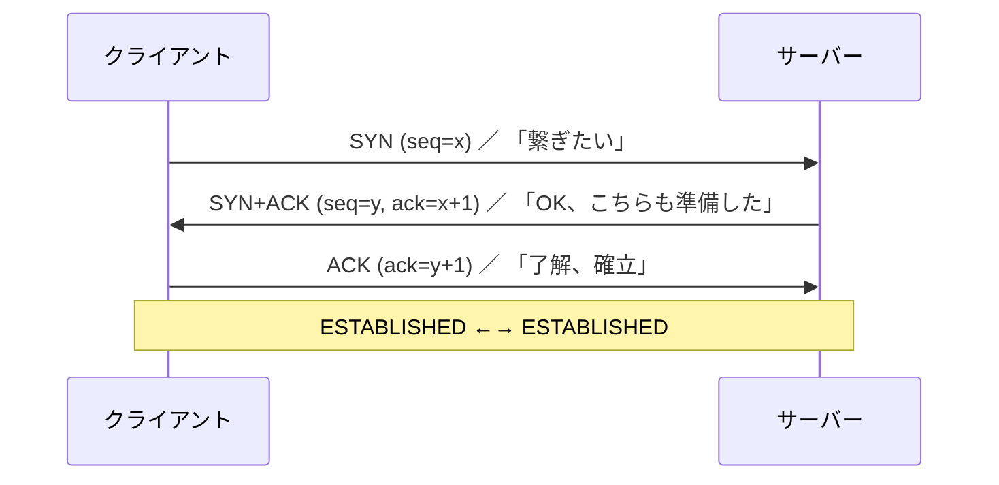

# Step 01 — 素の TCP エコー

## ゴール

- `net.Listen` / `net.Dial` で動く最小のサーバー/クライアントを書く。
- 「素の TCP は平文で、誰でも接続できる」ことを目で見て確認する。
- Step02 以降で TLS を載せたときに **何が増え、なぜ増えるのか** を語れる土台を作る。

## ファイル

| ファイル | 役割 |
|---|---|
| `server/main.go` | `:9000` で listen、行単位のエコーを返す |
| `client/main.go` | `localhost:9000` に接続、標準入力をそのまま送る |

## 動かす

ターミナルを2つ用意し、両方ともリポジトリのルートで作業します。

**ターミナル A — サーバー起動**

```bash
go run ./tutorial/step01-tcp-echo/server
# => step01 echo server listening on :9000 (plaintext TCP)
```

**ターミナル B — クライアント接続**

```bash
go run ./tutorial/step01-tcp-echo/client
# 何か入力して Enter すると、サーバーが "echo: ..." を返してくる
hello
echo: hello
```

`Ctrl-D` で切断、`Ctrl-C` でサーバー停止。

## TCP 接続が確立するまで (3way handshake)

`net.Dial` が返ってくる時点で、実は OS カーネルどうしが3つのパケットをやり取りしています。



各端の状態遷移は次のとおりです。

| 端 | 状態遷移 |
|---|---|
| サーバー | `CLOSED` → (`Listen`)→ `LISTEN` → (SYN受信)→ `SYN_RCVD` → (ACK受信)→ `ESTABLISHED` |
| クライアント | `CLOSED` → (`Dial`/SYN送信)→ `SYN_SENT` → (SYN+ACK受信)→ `ESTABLISHED` |

ポイントは、**この3パケットのやり取りはカーネル内で完結する**ということです。Go のコードからは「`Dial` がリターンした=確立した」「`Accept` がリターンした=確立済みのものが渡された」としか見えません。

### 自分の目で確かめる

サーバー起動中に別ターミナルで:

```bash
# macOS
sudo tcpdump -i lo0 -n 'tcp port 9000'
# クライアントを起動すると、SYN / SYN-ACK / ACK の3つが流れる

# 接続中のソケット一覧 (LISTEN と ESTABLISHED が見える)
lsof -nP -iTCP:9000
# あるいは
netstat -an -p tcp | grep 9000
```

サーバーが起動しただけだと `LISTEN` が1つだけ。クライアントが繋ぐと `ESTABLISHED` の組が増える、というのが目で見えます。

## `net.Listen` / `Accept` / `Dial` が裏で何をしているか

Go の API はだいたい POSIX の syscall を 1:1 で包んだものです。

| Go の呼び出し | 裏で起きる主な syscall | TCP の動き |
|---|---|---|
| `net.Listen("tcp", ":9000")` | `socket()` → `bind()` → `listen()` | サーバーソケットを `LISTEN` 状態にする。**まだ誰とも繋がっていない**。SYN を受けるたびにカーネルが内部の "accept queue" に積んでいく |
| `ln.Accept()` | `accept()` (空ならブロック) | accept queue から 1 つ取り出す。**取り出したときには既に handshake 完了済み**。新しいファイルディスクリプタ (= 新しい `net.Conn`) が払い出される |
| `net.Dial("tcp", "...")` | `socket()` → `connect()` | SYN を送り、SYN-ACK を待ち、最後の ACK を返した時点で `ESTABLISHED` になり、`connect()` がリターン |

ありがちな誤解と、そうじゃない正しい絵:

> ❌ 「`Accept` が呼ばれてから handshake が始まる」
>
> ✅ **Listen している間にカーネルが勝手に handshake をこなしてキューに積んでいる**。`Accept` は単に「キューから1個取り出す」だけ。

> ❌ 「`Dial` は TCP のパケットを 1 つ送るだけ」
>
> ✅ **`Dial` は handshake 3パケットの完了を待ってからリターン**する (失敗すれば error を返す)。

この理解は Step02 で重要になります。Step02 の `tls.Listen` も内部で `net.Listen` を使い、`Accept` 時点では **TCP は確立済み** で、TLS ハンドシェイク (= さらに数往復のパケット) はその上に乗ります。

## 全二重と「同時書き込み」の競合

> Q. クライアントとサーバーが同時に書き込んだら競合するの?

**TCP のレベルでは競合しません。** TCP コネクションは全二重 (full-duplex) で、各方向に独立したストリームと独立したバッファを持っています。

```
   client ====== A方向 (clientの送信 / serverの受信) ======> server
          <===== B方向 (serverの送信 / clientの受信) =======
```

A 方向と B 方向はカーネル内では別々のキューで管理されているので、両者が同時に `Write` してもデータは混ざりませんし、互いをブロックすることもありません。

### ただし、気をつけるパターンが3つあります

**(1) 同じ conn の同じ方向に複数 goroutine で Write すると順序が混ざる**

```go
go fmt.Fprintln(conn, "A1\nA2\n") // goroutine 1
go fmt.Fprintln(conn, "B1\nB2\n") // goroutine 2
// 受信側で "A1\nB1\nA2\nB2\n" のように混ざる可能性がある
```

`net.Conn` の `Write` 自体は内部で `mutex` を持っているので「データ破壊」までは起きませんが、**書き込み単位の境界**は保証されません。1 接続 1 方向は基本的に1つの goroutine が責任を持つのが安全です。本ステップの server は `handle` goroutine 内で `Read → Write` を直列にやるので、この問題は起きません。

**(2) 受信側が Read を止めるとバックプレッシャーがかかる**

カーネルの受信バッファが埋まると、TCP の advertised window が 0 になり、相手の `Write` が **ブロックする** ようになります。設計時の罠としては:

```
両者のロジック: "全部書ききってから読む"
両者の送信量 > バッファサイズ
→ 両者とも Write でブロック → 一生 Read に到達しない → デッドロック
```

教材の echo サーバーは「1 行 Read → 1 行 Write」のループなので、この罠は踏みません。本格的にプロトコルを設計するときは、**読みながら書く / 書きながら読む** が原則です。本教材のクライアントが受信側を別 goroutine にしているのは、まさにこの「同時並行」のためです。

**(3) `Close` の半端な閉じ方**

`conn.Close()` は両方向を一度に閉じますが、`*net.TCPConn` には `CloseWrite()` (こちらからの送信だけ閉じる = 相手にとっての EOF を流す) があります。「送るものは送りきって、相手の応答だけ受け取る」というプロトコルではこちらを使います。

### 実際にやってみる

ターミナル A でサーバーを起動したまま、ターミナル B/C の2つから同時にクライアントを起動してみてください。

```bash
# ターミナル B
go run ./tutorial/step01-tcp-echo/client
# "alice" と打つ → "echo: alice"

# ターミナル C (同時に)
go run ./tutorial/step01-tcp-echo/client
# "bob" と打つ → "echo: bob"
```

サーバー側ログには2つの `connected: ...` が並び、それぞれ別の goroutine (= 別の `net.Conn`) で処理されているのが分かります。**接続が違えばカーネル内のバッファも別**なので、互いの送受信は完全に独立しています。

## 観察ポイント

### 1. 誰でも喋れる

クライアントを使わなくても接続できます。TCP には相手の身元を確かめる仕組みがないからです。

```bash
nc localhost 9000
# あるいは
printf 'hello\n' | nc -q1 localhost 9000
```

### 2. 平文で流れている

別ターミナルで `tcpdump` を使うと、ネットワークを流れるデータが文字列のまま見えます (要 root)。

```bash
sudo tcpdump -i lo0 -A 'tcp port 9000'
```

サーバーへ送った文字列がそのまま生で見えるはずです。WiFi など物理メディアを共有する環境では、第三者にもこのとおり中身が見えてしまうということです。

### 3. ハンドシェイクのコストはゼロに近い

`Dial` してすぐ `Write` できます。後で TLS を載せると、暗号化セッションを確立するためのハンドシェイクが挟まることになります。

## 問題提起 (Step02 への布石)

このステップで作ったサーバーには、運用上3つの大きな弱点があります。

1. **盗聴**: 経路上の誰でも内容を読める。
2. **改ざん**: 経路上の誰でも内容を書き換えられる。
3. **なりすまし**: クライアントは「自分が本当に意図したサーバーに繋がっているか」を確認できない。

このうち **(1)(2)(3) を一気に解決する**のが、次の Step02 で導入する TLS (サーバー認証) です。
