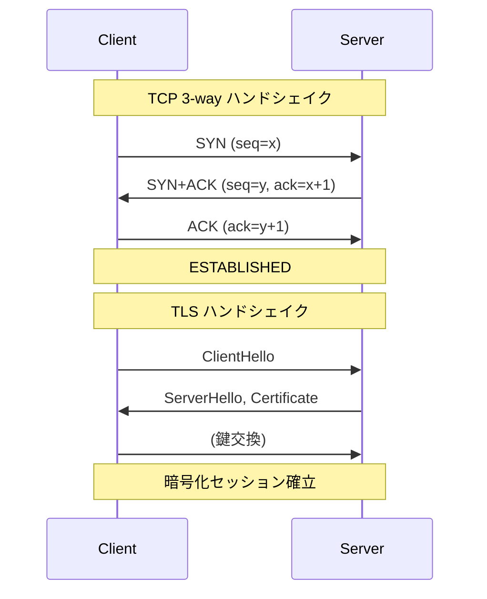

# Step 02 — TLS (サーバー認証のみ)

## ゴール

- `tls.Listen` / `tls.Dial` を使って **TLS で暗号化された TCP** を成立させる。
- サーバーが提示する証明書を、クライアントが「信頼する CA」で検証するという流れを掴む。
- `tls.Config` の主要フィールド `Certificates` / `RootCAs` / `ServerName` の役割を説明できるようにする。

このステップでは **クライアントは身元を提示しない**。Step03 (mTLS) でそれを足します。

## 前提

証明書が必要です。リポジトリのルートで一度だけ実行してください。

```bash
make certs
# あるいは
./scripts/gen-certs.sh
```

`tutorial/step02-tls/certs/` 直下に `ca.crt`, `server.crt`, `server.key` が並べば OK です。

## ファイル

| ファイル | 役割 |
|---|---|
| `server/main.go` | `:9443` で TLS listen。`server.crt` を提示 |
| `client/main.go` | `localhost:9443` に TLS で接続。`ca.crt` でサーバーを検証 |
| `certs/` | `gen-certs.sh` が配置 (`.gitignore` で除外) |

## 動かす

**ターミナル A**

```bash
go run ./tutorial/step02-tls/server
# => step02 TLS server listening on :9443 (server auth only)
```

**ターミナル B**

```bash
go run ./tutorial/step02-tls/client
# => connected to localhost:9443 over TLS (server CN=localhost)
hello
echo: hello
```

## ハンドシェイクで何が起きているか

1. クライアントが `ClientHello` を送る (使える暗号アルゴリズム一覧、SNI=`localhost` など)。
2. サーバーが `ServerHello` と **自分の証明書チェーン** を返す。
3. クライアントは:
    - 証明書のチェーンが `RootCAs` のどれかに辿り着くか検証
    - 証明書の SAN に `ServerName` (= `localhost`) が含まれるか検証
    - 証明書の有効期限内か、署名が壊れていないかを検証
4. 鍵交換 → 共通鍵を作って暗号化セッション開始。
5. 以降のアプリケーションデータは AES などの共通鍵暗号で暗号化される。



ここまでを通ると、Step01 にあった「盗聴」「改ざん」「サーバーのなりすまし」が解決されます。

## 観察ポイント (実験してみよう)

### 1. ServerName を変えると失敗する

`client/main.go` の `serverName` を `"example.com"` に書き換えて実行すると、ハンドシェイクが失敗します。証明書の SAN は `localhost` / `127.0.0.1` だけで、`example.com` ではないからです。

> Go 1.15 以降、証明書の **CommonName ベースの検証は廃止**されています。`subjectAltName (SAN)` のみが見られます。`gen-certs.sh` で SAN を明示しているのはこのためです。

### 2. CA を信頼しないとどうなるか

クライアント側で `RootCAs` を渡さない (`pool` の設定をコメントアウト) と、`x509: certificate signed by unknown authority` で失敗します。OS の信頼ストアにも我々のオレオレ CA は入っていないからです。

### 3. Step01 のクライアントは喋れない（平文 TCP は TLS サーバーに通らない）

TLS サーバーに TLS 非対応のクライアントが繋いでも、**平文 TCP にフォールバックされることはありません**。

実際に試してみましょう。

**ターミナル A**（Step02 サーバーを起動）
```bash
go run ./tutorial/step02-tls/server
```

**ターミナル B**（Step01 クライアントをポート 9443 に向けて接続）
```bash
# Step01 クライアントのポートを一時的に 9443 に変えて実行するか、
# 以下のスクリプトで動作を確認できる
go run ./tutorial/step01-tcp-echo/client
# => 9000番ポートに繋ごうとするのでサーバーが起動していなければ失敗
```

Step01 クライアントのアドレスを `localhost:9443` に変えて実行すると、以下のような結果になります。

```
TCP connected to localhost:9443        ← TCP 接続は成功する
sent: hello from plaintext client      ← 平文データを送れる
connection closed by server            ← サーバーが即座に切断する
```

**なぜ切断されるか**:

1. TCP 3-way ハンドシェイクは成功するため、TCP レベルでは接続できます
2. `tls.Listen` で待っているサーバーは、接続後に受け取る最初のバイト列が **TLS の `ClientHello`** であることを期待します
3. 平文の `hello\n` が来た瞬間に「これは TLS ではない」と判断し、コネクションを切断します
4. サーバー側のログには `tls: first record does not look like a TLS handshake` というエラーが記録されます

> これは意図的な設計です。「TLS ポートで平文を受け入れてしまう」という脆弱性を防ぐため、TLS サーバーは TLS 以外の通信を一切受け付けません。ブラウザで `https://` のサイトにポート 443 で `http://` として繋ごうとしたときに接続が切られるのと同じ仕組みです。

### 4. openssl でも検証してみる

```bash
openssl s_client -connect localhost:9443 -CAfile tutorial/step02-tls/certs/ca.crt
```

`Verify return code: 0 (ok)` と出れば、Go のクライアントと同じ理屈で検証が通っています。出力末尾の `Server certificate` セクションで SAN が確認できます。

## パケットダンプ

`tcpdump` で実際に観測した本ステップのハンドシェイクを [`tls-dump.txt`](tls-dump.txt) に置いてあります。`ClientHello` / `ServerHello` / `Certificate` などのレコードがどう流れているか、生のバイト列で確認できます。

## 用語ミニまとめ

- **CA (認証局)**: 証明書に署名する権威。今回は自分で作ったルート CA。
- **証明書チェーン**: 「葉 (server.crt) → 中間 CA → ルート CA」のように検証可能な署名の連鎖。今回は中間 CA なし。
- **SAN (Subject Alternative Name)**: 証明書が「どのホスト名/IP を名乗ってよいか」のリスト。
- **SNI (Server Name Indication)**: 1つの IP で複数ホストを捌くため、クライアントが ClientHello に乗せて送るホスト名。
- **`RootCAs`**: クライアント側が信頼する CA 集合。
- **`Certificates`**: サーバー側が提示する証明書/鍵ペア。

## 次へ (Step03 で解決すること)

ここまでで「サーバーが本物か」は確認できました。しかし、サーバー側からは **「繋いでくる相手が誰か」を確認できていません**。誰でも (CA さえ無視すれば誰でも) サーバーに繋げてしまいます。

Step03 では、**クライアントにも証明書を出させて、サーバーがそれを検証する** = mTLS にします。
