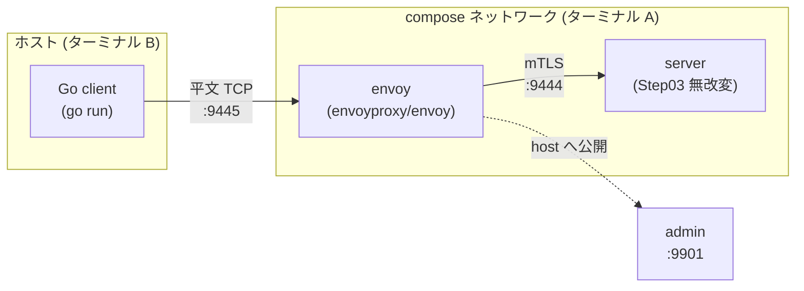

# Step 04 — Envoy を sidecar にして mTLS を肩代わりさせる

## ゴール

- アプリ (Go クライアント) から TLS コードを **すべて剥がし**、平文 TCP で Envoy に喋らせる。
- Envoy 側で **クライアント証明書を提示する mTLS の起点 (originate)** を構成する。
- Envoy の主要構成要素 (`listener` / `filter chain` / `cluster` / `endpoint` / `transport_socket` / `admin`) を、最小の YAML を読みながら把握する。

実運用の service mesh (Istio / Linkerd) が「アプリの隣に sidecar を立てて mTLS を肩代わりさせる」のと同じ構図を、ローカルで一番小さく再現します。

## 構成図



- **クライアント**: ホスト側で `go run`。`localhost:9445` に **平文 TCP** で繋ぐだけ。`crypto/tls` も `crypto/x509` も import しない。
- **サーバー**: Step03 の `tutorial/step03-mtls/server` を **無改変のまま**、`golang:1.26-alpine` イメージにバインドマウントして `go run` で起動。compose ネットワーク内では `server:9444` で名前解決される。
- **Envoy**: `envoyproxy/envoy:v1.33-latest` イメージ。上流は `server:9444` (Docker の組み込み DNS が解決)。ホストには `:9445` (listener) と `:9901` (admin) を公開。
- **証明書**: `tutorial/step03-mtls/certs/` を Envoy にマウントして再利用 (新規生成しない)。

Envoy とサーバーが同じ compose ネットワーク内に並ぶ姿は、Kubernetes における **Pod 内 sidecar** の絵にほぼ一致します (Pod 内のコンテナ群が同じ network namespace を共有するのと、compose ネットワークでサービス名解決が効くのは構造的に近い)。

## 前提

```bash
# Step03 で生成した証明書がそのまま要る
make certs

# Docker (Desktop) と docker compose v2 が動いていること
docker version
docker compose version    # 2.x が出れば OK
```

`tutorial/step03-mtls/certs/` 直下に `ca.crt`, `server.crt`, `server.key`, `client.crt`, `client.key` が並んでいれば OK (サーバーもコンテナで動かすので server 系も要る)。

## ファイル

| ファイル | 役割 |
|---|---|
| `client/main.go` | `:9445` (Envoy) に平文 TCP で繋ぐだけのクライアント (ホスト側で動かす) |
| `envoy/envoy.yaml` | Envoy の静的設定。listener/cluster/transport_socket/admin |
| `compose.yaml` | Envoy + Step03 サーバーを 1 ネットワーク内で立ち上げる定義 |

## 動かす

ターミナルを 2 つ使います。

**ターミナル A — Envoy + サーバーを compose で起動**

リポジトリルートから:

```bash
docker compose -f tutorial/step04-envoy-mtls/compose.yaml up
```

または `cd` してから:

```bash
cd tutorial/step04-envoy-mtls
docker compose up
```

ログに以下の 2 行が両方揃ってからクライアントを叩きます。

```
server-1  | step03 mTLS server listening on :9444 (mutual auth)
envoy-1   | starting main dispatch loop
```

> 初回は `golang:1.26-alpine` (≈100MB) と `envoyproxy/envoy:v1.33-latest` の pull が走ります。サーバー側は `go run` で起動時に毎回コンパイルが走るので、コンテナ起動から listening まで数秒かかります。`depends_on` は **コンテナ起動順** しか揃えないため、Envoy のほうが先に "starting main dispatch loop" を出すことがあります。サーバーの listening ログを待ってからクライアントを動かしてください。

**ターミナル B — ホスト側で平文クライアント**

リポジトリルートから:

```bash
go run ./tutorial/step04-envoy-mtls/client
# => connected to localhost:9445 (plaintext) — Envoy will originate mTLS to upstream
hi
hello alice@example.com, you said: hi
```

サーバー側ログ (compose の `server-1`) には Step03 と同じく `peer CN=alice@example.com` が出ます。**サーバーにとっては「直接の相手は envoy コンテナ」だが、提示された証明書の CN は `alice@example.com`** という構図です。

**撤収**

```bash
# Ctrl-C で compose プロセスを止めるか、別ターミナルから:
docker compose -f tutorial/step04-envoy-mtls/compose.yaml down
```

## クライアント側コードの変化

Step03 client と Step04 client を見比べると、`tls.Config` の組み立てと `tls.Dial` がまるごと消えています。

| | Step03 (直接 mTLS) | Step04 (Envoy 経由) |
|---|---|---|
| import | `crypto/tls`, `crypto/x509` あり | `net` だけ |
| 鍵/証明書のロード | アプリで `LoadX509KeyPair` | Envoy がファイルから読む |
| 接続呼び出し | `tls.Dial(...)` | `net.Dial("tcp", ...)` |
| 接続先 | サーバー本体 `:9444` | Envoy のローカル listener `:9445` |
| 行数 (おおよそ) | 70 行強 | 35 行 |

mTLS 設定の責任が **アプリのバイナリ** から **Envoy の YAML** に動いただけで、ネットワーク上で起きていることは Step03 と同じです。

## Envoy 設定の読み方

`envoy/envoy.yaml` の構造を下から順に読み解きます。

### `listener` — 入口

```yaml
listeners:
  - address: { socket_address: { address: 0.0.0.0, port_value: 9445 } }
    filter_chains:
      - filters:
          - name: envoy.filters.network.tcp_proxy
            typed_config:
              cluster: mtls_upstream
```

`:9445` で TCP を受け、**filter chain** の `tcp_proxy` がそれをそのまま `mtls_upstream` クラスタへ流します。echo は HTTP ではないので L7 (`http_connection_manager`) は使いません — L4 透過プロキシです。

### `cluster` — 上流の論理グループ

```yaml
clusters:
  - name: mtls_upstream
    type: STRICT_DNS
    load_assignment:
      endpoints:
        - lb_endpoints:
            - endpoint: { address: { socket_address: { address: server, port_value: 9444 } } }
```

`cluster` は「同じ役割の上流ホストの集合」を表す Envoy の単位です。今回はエンドポイントが 1 つだけ (Step03 サーバー)。複数ある場合はここで負荷分散の対象になります。

`address: server` は **`compose.yaml` の `services.server` という名前** を Docker の組み込み DNS が解決します。Kubernetes における Service 名による DNS と同じ発想で、IP を直接書かないので Pod/コンテナの再起動で IP が変わっても追従します。

> **`type: STRICT_DNS` にする理由**  
> `type: STATIC` は address にリテラルの IP アドレスしか受け付けません。`server` のようなホスト名を指定すると "malformed IP address" エラーで起動に失敗します。  
> `STRICT_DNS` にすると Envoy が DNS を引いて IP に解決するため、compose ネットワーク内の `server` サービス名が正しく使えます。

### `transport_socket` — 上流との間の暗号化

```yaml
    transport_socket:
      name: envoy.transport_sockets.tls
      typed_config:
        "@type": .../UpstreamTlsContext
        sni: localhost
        common_tls_context:
          tls_certificates:
            - certificate_chain: { filename: /certs/client.crt }
              private_key:       { filename: /certs/client.key }
          validation_context:
            trusted_ca: { filename: /certs/ca.crt }
            match_typed_subject_alt_names:
              - san_type: DNS
                matcher: { exact: localhost }
```

ここが **Step03 client の `tls.Config` と等価**な部分です。対応関係:

| Step03 `tls.Config` | Envoy YAML |
|---|---|
| `Certificates` | `tls_certificates` (chain + key) |
| `RootCAs` | `validation_context.trusted_ca` |
| `ServerName` (SNI) | `sni` |
| SAN マッチ (Go 1.15+ の標準動作) | `match_typed_subject_alt_names` |

`UpstreamTlsContext` は「自分が **クライアント** として上流に繋ぐとき」の TLS 設定。逆に、Envoy をサーバーとして使う場合は `DownstreamTlsContext` で `require_client_certificate` 等を組みます (このステップでは使いません)。

### `admin` — 観察口

```yaml
admin:
  address: { socket_address: { address: 0.0.0.0, port_value: 9901 } }
```

`:9901` でメトリクスや設定ダンプを返す管理 API。**Envoy のデバッグはまずここを叩く** のが定石です (後述)。

## 観察ポイント (実験してみよう)

### 1. クライアント → Envoy 区間が平文であることを目で見る

Envoy リスナーはホストに公開されているので、`:9445` だけはホストの loopback で `tcpdump` できます。

```bash
sudo tcpdump -i lo0 -A 'tcp port 9445'
# クライアントを動かすと "hi" や "hello alice@example.com..." が生で見える
```

一方、Envoy → サーバーの **mTLS 区間 (`server:9444`)** は **compose の bridge ネットワーク内に閉じている** ため、ホストの `lo0` には流れず `tcpdump -i lo0` では捕まえられません。「暗号化されている」ことを確かめる代替手段:

```bash
# Envoy のログで TLS ハンドシェイクの様子を見る
docker compose -f tutorial/step04-envoy-mtls/compose.yaml logs envoy | grep -i 'tls\|ssl\|handshake'

# admin の cluster 統計で "ssl.handshake" が増えていることを確認
curl -s 'localhost:9901/stats?filter=mtls_upstream.*ssl' | head
# 例: cluster.mtls_upstream.ssl.handshake: 1
```

**実際に envoy ↔ server 区間のパケットを Wireshark で見る**

「`tcpdump -i lo0` では捕まえられない」のは、compose ネットワークが **コンテナの network namespace に閉じている** ためです。サーバーコンテナの netns に **サイドカーで間借り** すれば、その `eth0` をそのままキャプチャできます。macOS の Docker Desktop でも同じ手順が通ります (ホストから docker bridge は見えませんが、コンテナの中に潜り込めば中の NIC は触れます)。

```bash
# サーバーコンテナの netns を共有し、tcpdump で pcap を吐く
# (コンテナ名は `docker compose ps` で確認。プロジェクト名次第で末尾の番号が変わる)
docker run --rm --net container:step04-envoy-mtls-server-1 \
    -v "$PWD":/out nicolaka/netshoot \
    tcpdump -i eth0 -s 0 -w /out/inter.pcap 'tcp port 9444'
```

`nicolaka/netshoot` は `tcpdump` / `tshark` / `dig` などが同梱された診断用イメージで、サーバー/Envoy のイメージには何も足さずに済みます。別ターミナルでクライアント (`go run ./tutorial/step04-envoy-mtls/client`) を 1 往復走らせ、`Ctrl-C` で `tcpdump` を止めると、カレントディレクトリに `inter.pcap` ができます。ホストの Wireshark で開けば、`ClientHello` から始まる TLS ハンドシェイクと、その後に続く暗号化済み `Application Data` が見えます (Step02/03 の `tls-dump.txt` と同じ形)。

仕組みのキモは `--net container:<name>`。これは **「指定コンテナと同じ netns で新しいプロセスを起こす」** Docker のフラグで、Linux の `setns(2)` をラップしたものです。Pod 内サイドカーで `localhost` がアプリと共有される話と同じ仕組みで、Step 04 の sidecar パターンの理解そのものを実演する観察方法でもあります。

ポイントは **「プロセス境界 (= compose 内 envoy ↔ server コンテナ) を跨いだ瞬間に暗号化される」** こと。実環境では平文 listener (`:9445`) はループバックや Unix domain socket に閉じ込め、外に出さないのが定石です。

### 2. compose ネットワークの DNS で `server` が引けることを確認

Envoy が `host.docker.internal` を使わずに済んでいる本質は、compose の組み込み DNS にあります。実際に引いてみます:

```bash
docker compose -f tutorial/step04-envoy-mtls/compose.yaml exec envoy nslookup server
# (envoy イメージに nslookup が無ければ getent でも可)
docker compose -f tutorial/step04-envoy-mtls/compose.yaml exec envoy getent hosts server

# envoy から server コンテナの :9444 が直接見えていることを確認
docker compose -f tutorial/step04-envoy-mtls/compose.yaml exec envoy nc -zv server 9444 || true
```

Kubernetes の `Service` 名解決と同じ発想です。Istio/Linkerd で envoy が `productpage:9080` のようなアドレスを使っているのも、根は同じ仕組み。

### 3. Envoy admin API で構成と健全性を確認

```bash
# クラスタの状態 (上流が到達可能か)
curl -s localhost:9901/clusters | grep mtls_upstream

# mTLS 系の統計だけ抽出
curl -s 'localhost:9901/stats?filter=ssl|mtls'

# 起動中の有効設定をフルダンプ (YAML から展開された姿)
curl -s localhost:9901/config_dump | jq '.configs[] | select(.["@type"] | contains("Cluster"))'

# リスナー一覧
curl -s localhost:9901/listeners
```

特に **`/clusters` に `cx_total` (接続総数)** が出るので、クライアントを動かす前後で増えるのが確認できます。

### 4. 別 CA に差し替えて Envoy が拒否することを確認

Envoy の `validation_context.trusted_ca` を **別の CA** にすると、上流サーバー証明書の署名検証に失敗します。簡単な確認方法:

```bash
# 本物の ca.crt を退避してから別 CA で上書きし、compose を再起動 (マウント先を読み直させる)
mv tutorial/step03-mtls/certs/ca.crt tutorial/step03-mtls/certs/ca.crt.good
openssl req -x509 -new -nodes -newkey rsa:2048 -days 1 \
    -subj "/CN=Wrong CA" -keyout /tmp/wrong.key -out tutorial/step03-mtls/certs/ca.crt

docker compose -f tutorial/step04-envoy-mtls/compose.yaml restart envoy
go run ./tutorial/step04-envoy-mtls/client
# Envoy ログに以下のような行が出る:
#   TLS error: ...:CERTIFICATE_VERIFY_FAILED
# クライアントからは TCP は通るが直後に切られる (= Envoy が上流に繋げず断)

# 後始末
mv tutorial/step03-mtls/certs/ca.crt.good tutorial/step03-mtls/certs/ca.crt
docker compose -f tutorial/step04-envoy-mtls/compose.yaml restart envoy
```

`UpstreamTlsContext` の検証は **Step02 で見た RootCAs 検証と完全に同じ** ロジックです (内部的には BoringSSL/OpenSSL の `X509_verify`)。

### 5. 上流を落とすと Envoy がどう振る舞うか

サーバーコンテナだけ止めてからクライアントを動かしてみます:

```bash
docker compose -f tutorial/step04-envoy-mtls/compose.yaml stop server
go run ./tutorial/step04-envoy-mtls/client
# クライアントは接続が即座に切れるか、何も応答せず閉じられる
# `/clusters` の health 表示も変わる:
curl -s localhost:9901/clusters | grep mtls_upstream

# 復旧
docker compose -f tutorial/step04-envoy-mtls/compose.yaml start server
```

`connect_timeout: 1s` を効かせているので、ハングはしません。

### 6. 設定をホットリロードする (発展)

Envoy はファイル監視によるホットリロードを直接やらず、**xDS (動的設定 API)** で外部の control plane (Istiod / Consul / 自作) から設定を流し込むのが標準です。本ステップは `static_resources` だけで完結させる最小構成。`xDS` は次のステップの題材になり得ます。

## 用語ミニまとめ

- **listener**: Envoy が接続を受ける入口 (`address` + `port`)。Pod なら通常 1 つ、ホスト型運用なら複数。
- **filter chain / network filter**: listener が受けた L4 接続をどう処理するかのパイプライン。`tcp_proxy` (透過プロキシ), `http_connection_manager` (L7) などが入る。
- **cluster**: 「同じ役割の上流ホスト群」の論理単位。LB ポリシー、ヘルスチェック、サーキットブレーカ、TLS などはここに付く。
- **endpoint**: cluster の中の実体 (host:port)。`STATIC` / `STRICT_DNS` / `EDS` などで決まり方が変わる。
- **`transport_socket`**: 「相手との間でどう暗号化するか」。listener 側は `DownstreamTlsContext`、cluster 側は `UpstreamTlsContext`。
- **SNI**: クライアント (= 今回は Envoy) が ClientHello に乗せるホスト名。Step02 で出てきたものと同じ。
- **admin interface**: 設定・統計・ログレベルを操作する管理ポート。**本番では外部に晒さないこと**。
- **xDS**: 設定を動的に配信する gRPC API 群 (LDS/CDS/EDS/RDS/SDS など)。本ステップでは使わない。
- **sidecar**: アプリと同じネットワーク名前空間に同居して入出力を肩代わりするプロキシの配置パターン。

## ここまでで身についたもの

- 「mTLS の責任をどこに持たせるか」を、**アプリ内 (Step03)** と **プロセス境界の sidecar (Step04)** の 2 通りで構成できる。
- Envoy の最小構成 (listener → filter chain → cluster → transport_socket) を YAML から書ける。
- `tls.Config` と `UpstreamTlsContext` のフィールド対応が頭に入った状態で、Istio / Consul Connect / Linkerd など実運用の mesh 設定を読める下地ができる。

## 注意 (本番運用へ向けて)

- 平文 listener (`:9445`) は **必ずループバックか Unix domain socket** に閉じ込める。今回の `0.0.0.0` バインドは「Docker のネットワーク境界の中だから」許容しているだけ。
- admin インターフェースは **同じく外部公開しない**。`/quitquitquit` でプロセスを落とせるなど強力な口が並んでいる。
- 証明書のローテーションは、本番では **SDS (Secret Discovery Service)** で動的に配るのが標準。ファイル直マウントは教材限定の手抜き。
